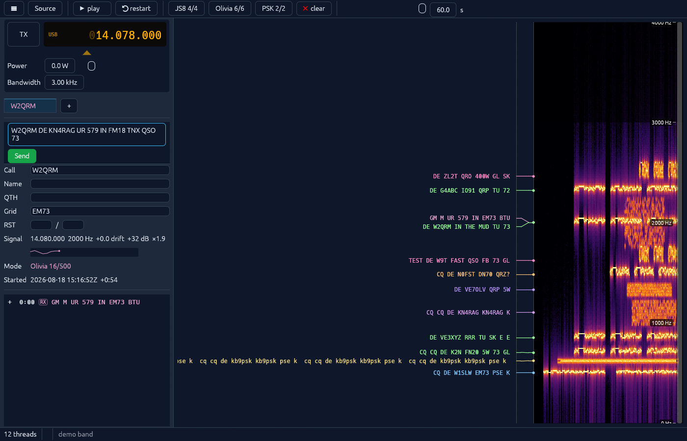
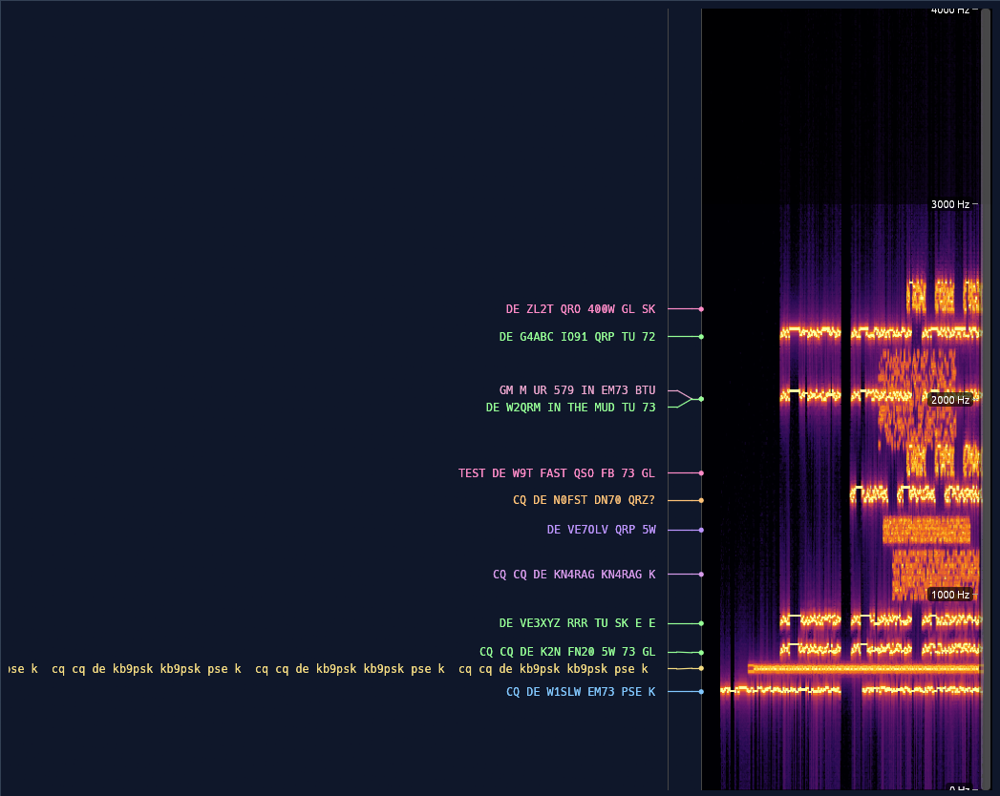
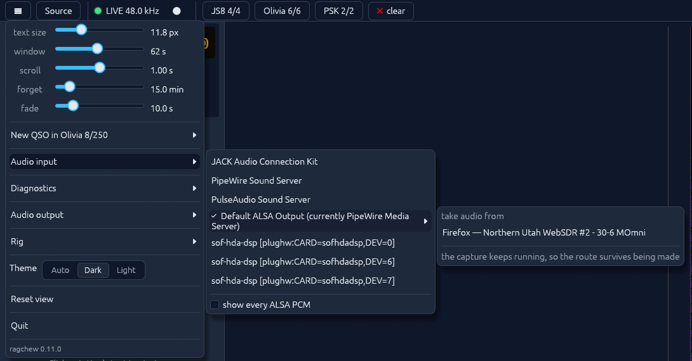
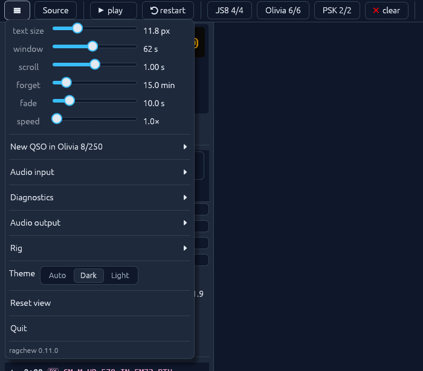
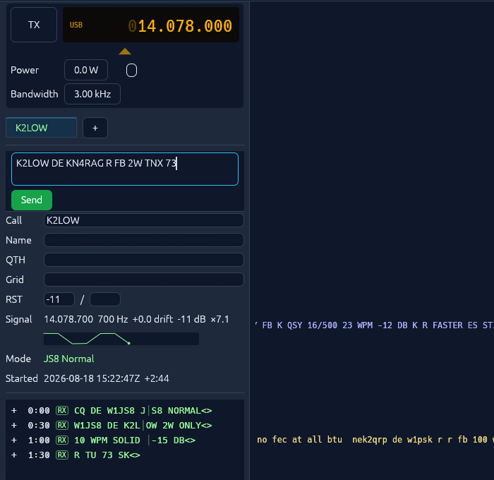
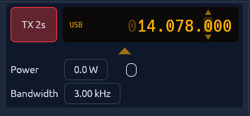
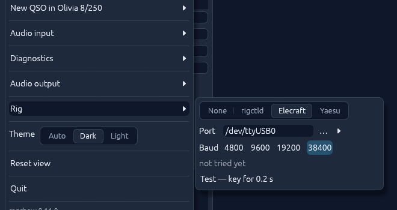
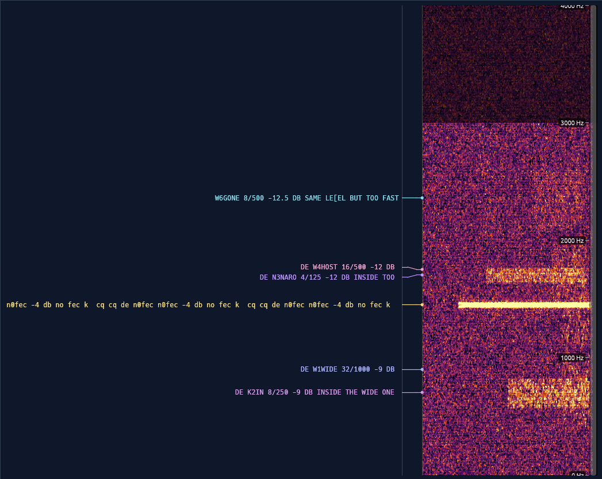

# ragchew

A panoramic monitor for HAM radio keyboard-to-keyboard digital modes. Point it
at a receiver and it shows you a waterfall of the whole audio passband with
every conversation in it decoded and printed alongside, on a row that lines up
with the signal it came from — whatever mode that signal happens to be using.



Three protocol families are decoded side by side: **JS8** in all four submodes,
**Olivia** MFSK at any `tones/bandwidth` pair, and **PSK31/PSK63**. You do not
tell it which one to expect. It scans for all of them at once, groups what it
finds into threads by protocol and frequency, and colours each thread by mode,
so a band with a JS8 net at 700 Hz, an Olivia QSO at 1800 and somebody calling
CQ on PSK31 in between reads as three conversations rather than one pile of
text.

Click a station's text and it opens as a QSO: a tab with the usual fields over a
log of the exchange, a box to type a reply into, and a **Send** button that
modulates what you typed at that station's carrier and mode and keys the radio
to send it. So it is a monitor first, and a working terminal second — which is
the order most operators actually use one in.

All of it is written from scratch in Rust — the modems, the FEC, the sync
search, the waterfall, the interface. Nothing is shelled out to fldigi or
JS8Call, no C DSP library is linked in, and the decoders are not a binding onto
somebody else's: the LDPC decoder, the Walsh transform, the varicode tables and
the frequency searches are all in this repository, in safe Rust. The library
that does the decoding has **one** dependency, `rustfft`, and not a single
`unsafe` block in it.

## Installing

There are no packages yet — you build it, which on a machine with Rust already
on it is one command.

**Linux** needs the development headers for the audio, windowing and file-dialog
stacks. On Debian or Ubuntu:

```
sudo apt-get install libasound2-dev libgtk-3-dev libxkbcommon-dev \
     libxcb-render0-dev libxcb-shape0-dev libxcb-xfixes0-dev libwayland-dev
```

**macOS and Windows** need nothing beyond the toolchain; their SDKs carry the
equivalents.

Then, with a stable Rust toolchain ([rustup](https://rustup.rs) if you have
none):

```
git clone https://github.com/ahenshaw/ragchew
cd ragchew
cargo build --release
./target/release/ragchew
```

Run with no arguments and it opens listening to the default audio input, which
is what it is for:

```
ragchew                  # listen to the default audio input
ragchew recording.wav    # decode a recording instead
ragchew --demo           # a synthetic band, with no radio involved
```

`--help` lists the rest.

To start it from the desktop's application menu instead of a terminal:

```
./target/release/ragchew --install
```

That writes a launcher entry and its icons under `~/.local/share`, pointing at
the copy of the binary you ran it from — so run the one you mean to keep, and
run it again if you move it. It needs no privileges, and deleting the files it
names undoes it.

Before wiring anything to a radio, it is worth half an hour with the synthetic
bands: `ragchew --demo` opens twelve stations across all three protocols with no
hardware involved at all. See [bands to try without a radio](#bands-to-try-without-a-radio).

## The window

One waterfall down the right, the conversations to the left of it, a toolbar
across the top and a status line along the bottom. There are no dialogs to
speak of; nearly everything is done on the canvas itself.



Each thread's text sits on a row level with its own signal, joined to it by a
leader line where the rows have had to be nudged apart to fit. A row is
right-aligned on its newest character, so the eye can rest at the right-hand
edge and read what has just arrived; older text slides off to the left as more
comes in.

On the canvas:

- **scroll** to pan up and down the band
- **pinch**, or **ctrl+scroll**, to zoom
- **shift+scroll** to size the text
- **drag the gutter** between the text and the waterfall to give either side more room
- **click** a station's text to open it as a QSO
- **right-click** a row for *Clear this thread* / *Clear every thread*

The frequency axis is overlaid on the waterfall's right edge, and the bar there
shows where in the band you are looking; drag it to move around whatever the
zoom. Point at either and the status bar reads out the frequency under the
cursor — an audio offset from the dial, like every frequency in this app —
which is how you find what to tune to before there is any text to click.

The status bar also carries the thread count and the last thing that happened,
which is where a message like "could not listen to Firefox" goes.

### What it is listening to

**Source** is the menu for that: *Live input*, *Demo bands*, and *Open audio
file…* for a recording. A recording plays with a transport — play, pause,
restart, and a speed slider in the settings — and decodes as it goes, so a
night's capture can be watched back at ten times life. It has to be 12 kHz mono
16-bit PCM WAV, which is what the decoders work in and what `--record` writes;
transcode anything else with `ffmpeg -i in.mp3 -ac 1 -ar 12000 out.wav`.

Which sound card it captures from is **☰ ▸ Audio input**. ALSA advertises far
more PCMs than a machine has devices, so the list is winnowed by default and
*show every ALSA PCM* is there for whoever needs the one that got winnowed out.



On a PipeWire desktop the list does one thing more, and it is the reason many
people will run this at all: a WebSDR in a browser is how you listen to a band
you have no antenna for, and the capture entry gets a **take audio from**
submenu listing whatever is currently making noise — the browser, by tab title,
so you can tell two WebSDRs apart. Picking one wires the browser's output
straight into ragchew's capture. The capture itself is deliberately left open
while the graph is rewired around it, because reopening it would destroy the
node the link was just attached to.

### What it is scanning for

On the right of the toolbar, one menu per protocol, each listing its modes with
the colour that mode's threads are drawn in. The count on the menu (`Olivia
4/6`) is how many of them are on.

This is not only a legend. Every enabled mode costs scan time — the Olivia
search runs each mode's tone grid across the whole band — so turning off the
modes you are not interested in is how you buy the headroom to keep up with a
busy band. The modes stay listed whether or not they are being scanned for:
calling in a mode you are not listening to is unusual, but it is not wrong.

### Keeping the window readable

A band left running fills up with conversations that finished an hour ago, so
the window can be told to forget. **☰ ▸ forget** is how long a station's text
stays on its row and **fade** is how long it takes to go once it is that old.
The oldest text goes first, a piece at a time, so a station still talking keeps
what it has just said and loses only what it said too long ago; a station that
has been quiet for the whole timeout leaves the window altogether. It starts at
fifteen minutes — longer than any over, shorter than the gap that means the QSO
ended. Zero turns it off and keeps everything.

**clear**, under the red ✕ on the toolbar, takes every station's text off the
rows at once. None of this touches the decoding or the logs: an open
conversation keeps every word it took, cleared or not.

### Settings



**☰** holds the display settings — text size, how much time the waterfall window
covers, how smoothly it scrolls, the forget and fade timers, playback speed for
a recording — along with the audio input and output, rig control, the theme
(dark, light, or follow the desktop), *Reset view* and *Quit*.

Window size and position, the panel splits, text size, playback and waterfall
settings, the modes being scanned, the chosen audio input and output, the
palette and where in the band the view is pointed all persist between runs, in
`~/.local/share/ragchew/app.ron` on Linux. A saved view is fitted to the band on
the way in, so a settings file from another build — or one edited by hand —
cannot reopen the app zoomed into 50 Hz of nothing.

Conversations are not saved. A log is a record, and writing one is a logging
program's job.

## Working a station

Click a station's text and it opens as a **QSO** in the panel on the left, one
tab per conversation, labelled with the other operator's call as soon as the
text says what it is.



A tab carries the usual information — call, name, QTH, grid, signal reports —
over a log of the exchange, each line stamped with how far into the QSO it
landed and marked `RX` or `TX`. The log fills itself: a QSO follows the thread
it was opened on, so whatever that station decodes next appears whether or not
its tab is the one on top. **＋** opens a blank tab for a station not heard yet.

The Signal row is the measurement, not a setting: where the station is on the
band, how far its carrier has drifted since you first heard it, its
signal-to-noise in 2.5 kHz — the figure a signal report means — and the last
decode's confidence as a multiple of the mode's noise floor. Under it, once
there is a shape to draw, a small trace of how that SNR has been behaving. With
a radio on the other end of a cable the offset is also given as the frequency it
actually is, dial plus offset as the sideband has it, which is the number you
write in a log.

Under the log is a reply box, one per QSO, so a half-written transmission can be
left in one tab while you deal with another. **Send** — or Enter — modulates what
is in it at the QSO's carrier and mode and plays it out of the chosen audio
output, which is all a rig on a USB codec, or on VOX, needs. Olivia and PSK go
out immediately, being continuous; JS8 waits for the next boundary of its
submode's UTC cycle, and a message too long for one frame goes as several, one
per cycle.

**Abort** appears beside it while this conversation has something going out, and
it takes two presses on purpose. The first gives back whatever has not left yet
— it returns to the box, to edit and send again — and leaves the burst already
on the air to finish, which is what an operator fixing a typo wants. The second
stops the transmitter, which is the other thing entirely.

## Radio control

The rig's frequency reads out above the conversations, amber on black.



Every digit is its own control: scroll over one and it steps its own decade,
from single hertz at the right to tens of megahertz at the left, with small
arrows over and under for a hand that would rather click. Anywhere else on the
readout, a click of the wheel is a hundred hertz.

Click the readout and it takes the keyboard: **←→** move between digits, **↑↓**
step the one you are on, and typing a digit fills it and moves along, so a whole
frequency goes in as eight keystrokes from the left. A typed frequency shows in
a different colour until **Enter** sends it — entered a digit at a time it
passes through others on the way, and any of those is somewhere the radio would
actually go, in another band, on somebody else's QSO — while **Esc**, or
clicking away, puts back whatever the rig says. Steps made with the wheel or the
arrows need no Enter: each one is complete in itself.

Point at the mode beside the digits and the radio's own modes drop out of it;
click one and the rig changes to it. What is shown is what the rig reports —
turn the knob on the radio and the digits follow — except while the wheel is
being turned, when they follow the hand and hand back a second after it stops.

The **TX** button keys and unkeys by hand, for tuning up or checking into a
dummy load. It goes red for as long as the rig is transmitting, with a count of
how long it has been down, and amber instead when the rig is transmitting for a
reason the app did not ask for — a hand on the front panel, a foot switch, a
line stuck down. The rig is asked what it is doing twice a second rather than
assumed.

**Send** keys the rig itself once one is configured: the key goes down a tenth
of a second before the audio and comes up a tenth after it, and a JS8 message
that runs to several frames gets a key-down each, since the silence between
frames is seconds long and a key held across it is a bare carrier. If the rig is
not answering, the transmission does not go out at all and the status bar says
why — audio into a rig that did not key is silence at best, and on a station
left on VOX it is a transmission nobody asked for. A key-down is always followed
by a key-up: one is forced if a transmission outlasts its limit, if the app
exits, or if the thread doing the keying comes apart.

Nothing keys unless you configure it. The default is no keying at all.

### Setting a rig up



An **Elecraft** KX3 or K3 needs no daemon: **☰ ▸ Rig ▸ Elecraft**, the serial
port the cable is on, and the rate the radio's menu is set to (38400 from the
factory). The **…** beside the port lists what the machine says it has —
`/dev/serial/by-id/…` on Linux, named after the adapter rather than the order it
enumerated in, `cu.` devices on macOS, `COM` ports on Windows — and the field
stays typeable for a port that list does not know about. It keys, tunes, reads
the frequency and mode, and reads back whether the radio is transmitting.

A **Yaesu** is the same two settings: **☰ ▸ Rig ▸ Yaesu**, for an FT-991A,
FT-891, FT-710, FTDX10, FTDX101, and back through the FT-450D and FTDX3000. The
rate is menu 031, `CAT RATE`, and these leave the factory at 4800 rather than an
Elecraft's 38400. One thing it does not do is show the receiver's filter, or
shade the waterfall outside it: Yaesu reports the filter as an index into a
per-mode table rather than a width in hertz, and there is no honest way to turn
one into the other. The older FT-817 and FT-857 speak a different, binary CAT
and are not this.

For any other rig, **☰ ▸ Rig ▸ rigctld** points the app at hamlib. Run
`rigctld -m <model> -r <device>` and give it the address. Hamlib will not key a
rig it has no PTT method for, and says so with "not available on this rig";
`--set-conf=ptt_type=RIG` (or `RTS`, or `DTR`) is what it is asking for. That
applies to hamlib's own dummy too, which is the cheapest way to watch the whole
path work with no radio on the bench:

```
rigctld -m 1 -r /dev/null --set-conf=ptt_type=RIG
```

### Builds without a radio in them

Each directly-driven radio is its own cargo feature, so a build carries only the
protocols it will use. `elecraft` and `yaesu` are both on by default.

```
cargo build --release                                              # rigctld + both radios
cargo build --release -p ragchew-gui --no-default-features \
    --features desktop,yaesu                                       # rigctld + Yaesu
cargo build --release -p ragchew-gui --no-default-features \
    --features desktop                                             # rigctld only
```

`rigctld` is always built — it is one protocol for every rig hamlib knows, so
there is nothing to choose. A build without a given radio reads a settings file
that names it, keys nothing, and keeps the port and rate for the next build that
has it.

## Bands to try without a radio

Four synthetic bands, each built to show one thing, under **Source ▸ Demo
bands** or on the command line:

```
ragchew --demo          # twelve stations, all three protocols
ragchew --weak          # Olivia under the noise floor
ragchew --crowded       # Olivia stacked on top of itself
ragchew --signals       # three QSOs: what each mode costs
```

`--weak` is the one that shows what Olivia is *for*: six stations, every one of
them below the noise floor, several sitting inside each other's bandwidth, one
of them carrying no error correction at all — and the text comes out anyway.



`--signals` is the one to start with if the question is *which mode should I be
using*: three QSOs side by side, one per protocol, each a hundred-watt station
worked by a quiet one, where the quiet operator runs 20 W on PSK31, 5 W on
Olivia and 2 W on JS8 for the same margin over the same path — and JS8 charges
that back at a fifth of PSK31's typing speed.

[**docs/demo-bands.md**](docs/demo-bands.md) goes through all four station by
station, with the measured numbers and what each is meant to prove.

## Logs and recordings

Under **☰ ▸ Diagnostics**, or from the command line:

- `--csv` writes one row per decode — `utc,t_s,mode,hz,snr_db,quality,text` —
  which is the station's own record of what was heard. A night of traffic is a
  few kilobytes. This is the one to leave on.
- `--record` writes the 12 kHz mono audio the decoders actually see, about
  86 MB an hour, so a fault can be replayed exactly by opening the file again.
  There is a ⏺ on the toolbar for it too, because it is easy to leave on by
  accident and expensive when you do.
- The app's own log goes to the same place; grep it for `WARN` or `ERROR`
  first.

All three land in `~/.local/share/ragchew` unless `--log-dir` says otherwise.
Given a recording *and* `--csv`, no window opens at all: it decodes the file to
CSV and exits.

## All of it in Rust

The claim in the first paragraph is meant literally, and it is checkable:

```
grep -rc unsafe src/ | grep -v ':0'      # nothing
cargo tree -p ragchew --edges normal     # rustfft, and what rustfft brings
```

The first prints nothing, because there is no `unsafe` in the decode library at
all: zero blocks, one dependency, no FFTW, no libhamlib, no fldigi to shell out
to. The only `unsafe` anywhere in the workspace is in the two serial-port
backends, `gui/src/rig/serial/unix.rs` and `windows.rs`, where a `termios` or a
`DCB` has to be handed to the operating system. That is a serial port written
by hand rather than a crate pulled in, for the same reason: it is one struct and
four calls per platform, and it keeps the dependency list short enough to read.

What the language buys here is not tidiness, it is the ability to run the
decoders at all. A band scan is embarrassingly parallel and completely
unforgiving of a data race: every enabled mode searches the whole passband
against every block timing, and the results have to arrive as they finish rather
than in a lump. So the scan runs a thread per mode off the UI thread, and the
wait is the slowest mode rather than the sum of them — the window opens
immediately, the waterfall appears as soon as the spectrogram is ready, and text
streams in behind it. Live capture, decode, playback and rig polling are all
running at once, on a monitor that is expected to sit there for a night without
being restarted.

And it is fast enough to be worth doing that way: 20–60× real-time for an
Olivia band scan, ~35× for a full JS8 decode, single core, in release. There is
one catch, and it bites everyone once — a *debug* build decodes far too slowly
to keep up with live audio, so both crates are built optimised even in `dev`.
See [performance](docs/internals.md#performance) for the measurements that
forced that.

The application ships as one binary. No interpreter, no runtime, nothing to
install alongside it; on Linux it links ALSA and libc and that is about the
whole of `ldd`. Three platforms and every feature combination are built and
tested on each push.

## Under the hood

- [**docs/internals.md**](docs/internals.md) — how each protocol works, the
  module layout, decode performance, and how all three are validated bit-for-bit
  against independent implementations.
- [**docs/olivia-decoder.md**](docs/olivia-decoder.md) — the Olivia receive
  chain in detail: the tone grid, the search, how the thresholds are calibrated,
  and the two bugs only a real off-air recording exposed.
- [**docs/library.md**](docs/library.md) — using the decoders as a Rust library,
  the command-line tool, and the measuring harnesses.

## Written with Claude

Most of the code in this repository was written by Claude, in Claude Code, over
a lot of sessions. I set the direction, chose the trade-offs, ran the radio and
the recordings, and read everything that landed; the model did the typing and a
good deal of the thinking about how to do it.

That is worth saying out loud in a project like this one, because DSP is exactly
the kind of code an LLM can write plausibly and wrongly at the same time. A
decoder that is subtly broken still prints text, and a borrow checker has
nothing to say about a sign error in a soft-decision metric: Rust rules out one
whole class of mistake and not this one. The answer here was to make it hard to
be plausibly wrong: every protocol is checked bit-for-bit against an
independent implementation, the detection thresholds are measured by harnesses
that run the shipping code rather than chosen by eye, and the property the tests
guard hardest is that a band of pure noise produces **nothing at all**. See
[validation](docs/internals.md#validation) for what that comes to in practice.

## License

GPL-3.0-or-later. JS8/JS8Call and fldigi are GPL, as is Pawel Jalocha's MFSK
reference vendored in `tools/ref/olivia/jalocha/`; the embedded
`src/js8/jsc_words.txt` word list originates from JS8Call. The JS8 reference in
`tools/ref/js8/` is Robert Morris's `fate`, which is **MIT** — its licence text
travels with it as `LICENSE.fate`, as MIT requires.
